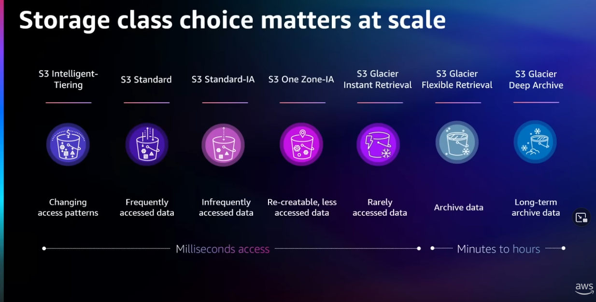
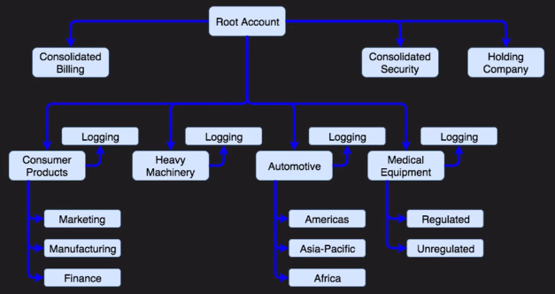
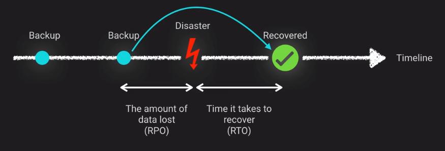

# Solution Architect Professional

## Table of Contents

1. [Data models](#data-models)
2. [EC2](#ec2)
3. [Network](#network)
4. [Security](#security)
5. [Migrations](#migrations)
6. [Architecture to scale](#architecting-to-scale)
7. [Business continuity](#business-continuity)
8. [Deployment & Operations management](#deployment-and-operations-management)
9. [Cost management](#cost-management)
10. [Additional readings](#additional-readings)

<https://d1.awsstatic.com/training-and-certification/docs-sa-pro/AWS-Certified-Solutions-Architect-Professional_Exam-Guide_C02.pdf>

## Data models

- ACID: Atomic, Consistency, Isolated, Durable - like databases
- BASE: Basic Availability, Soft-state, Eventual Consistency - like SNS/SQS, S3

Important:

- read the [AWS Storage options whitepaper](https://d1.awsstatic.com/whitepapers/aws-storage-options.pdf) and note anti-patterns
  - ✔️ [Storage Best Practices for Data and Analytics Applications](https://docs.aws.amazon.com/whitepapers/latest/building-data-lakes/building-data-lake-aws.html)
  - ✔️ [SaaS Storage Strategies](https://docs.aws.amazon.com/whitepapers/latest/multi-tenant-saas-storage-strategies/multi-tenant-saas-storage-strategies.html)
  - ✔️ [Best Practices Design Patterns: Optimizing Amazon S3 Performance](https://docs.aws.amazon.com/whitepapers/latest/s3-optimizing-performance-best-practices/welcome.html?did=wp_card&trk=wp_card)
- know when to use various data stores.

### Amazon S3

- Introduced in 2006, one of the first service
- Maximum object size is 5TB, max object single PUT is 5GB
- Recommended to use multi-part upload for file larger than 100MB
- Get a good view of the S3 storage class available
- Allow Torrent protocol, Hadoop distributed copy
- Each S3 object can have up to 10 object tags
- Each tag key can be up to 128 Unicode characters in length, and each tag value can be up to 256 Unicode characters in length
- can achieve at least 3,500 `PUT/COPY/POST/DELETE` and 5,500 `GET/HEAD` requests per second per prefix in a bucket
- no limits for the number of connections made to your bucket
- encrypted buckets have a upper limit and will throttle requests due to the KMS encrypt request account limit.
- [bucket policy examples](https://docs.aws.amazon.com/AmazonS3/latest/userguide/example-bucket-policies.html)
- [controlling access from VPC endpoints with bucket policies](https://docs.aws.amazon.com/AmazonS3/latest/userguide/example-bucket-policies-vpc-endpoint.html)

#### S3 Object Lambda

[S3 Object Lambda](https://aws.amazon.com/blogs/aws/introducing-amazon-s3-object-lambda-use-your-code-to-process-data-as-it-is-being-retrieved-from-s3/) uses a Lambda function to automatically process and transform the data as it is being retrieved from an S3 bucket.

### Amazon Glacier

- max file size is 40TB
- Glacier Vault lock to avoid archive to be changed / modified

### EBS

- Is single AZ!

### EFS

- Implementation of NFS file share
- Pay as you use
- Multi AZ metadata and storage
- Can be mounted on prem, recommended with the DataSync service
- More expensive than S3 and EBS (of course)
- As of December 2016, the common mount target name of an EFS file system will resolve to its local mount target in each AZ. So, you only need to create mount targets in each AZ within the same subnet as the EC2 instances then use the common FQDN.

_FAQ <https://aws.amazon.com/efs/faq/>_

### FSx

Amazon FSx makes it easy and cost effective to launch, run, and scale feature-rich, high-performance file systems in the cloud. It supports a wide range of workloads with its reliability, security, scalability, and broad set of capabilities. Amazon FSx is built on the latest AWS compute, networking, and disk technologies to provide high performance and lower TCO. And as a fully managed service, it handles hardware provisioning, patching, and backups.

FSx for NetApp, OpenZFS, Windows File Server, Lustre.

_FAQ: <https://aws.amazon.com/fsx/windows/faqs/>_

### Amazon Storage Gateway

- virtual machine that you run on-prem with VMware or HyperV
- provides local storage resources backed by Glacier and S3
- use in cloud migration or disaster recovery
- different modes:
  - file gateway (optional cache mode): S3 bucket seen as NFS share for on-prem
  - volume gateway (optional cache mode): async replication to s3 with iSCI
  - tape gateway: virtual tape device for backups (iSCI VTL)

Files written to this mount point are converted to objects stored in Amazon S3 in their original format without any proprietary modification. This means that you can integrate applications and platforms that don’t have native Amazon S3 capabilities.

### AWS DataSync

AWS DataSync is a secure, online service that automates and accelerates moving data between on premises and AWS Storage services. DataSync can copy data between Network File System (NFS) shares, Server Message Block (SMB) shares, Hadoop Distributed File Systems (HDFS), self-managed object storage, AWS Snowcone, Amazon Simple Storage Service (Amazon S3) buckets, Amazon Elastic File System (Amazon EFS) file systems, Amazon FSx for Windows File Server file systems, Amazon FSx for Lustre file systems, Amazon FSz for OpenZFS file systems, and Amazon FSx for NetApp ONTAP file systems.

#### Versus Storage Gateway

One is for optimized data movement, and the other is more suitable for hybrid architecture.

_AWS DataSync_ is ideal for online data transfers. You can use DataSync to migrate active data to AWS, transfer data to the cloud for analysis and processing, archive data to free up on-premises storage capacity, or replicate data to AWS for business continuity.

_AWS Storage Gateway_ is a hybrid cloud storage service that gives you on-premises access to virtually unlimited cloud storage.

You can combine both services. Use AWS DataSync to migrate existing data to Amazon S3, and then use the File Gateway configuration of AWS Storage Gateway to retain access to the migrated data and ongoing updates from your on-premises file-based applications.

### AWS Transfer Family

AWS Transfer Family securely scales your recurring business-to-business file transfers to AWS Storage services using SFTP, FTPS, FTP, and AS2 protocols.

### Amazon WorkDocs

- secure fully managed file collaboration service
- integrate with AS for SSO
- ISO compliant

### RDS

- Managed DB for:
  - MySQL,
  - Maria,
  - PostgreSQL,
  - Microsoft SQL,
  - Oracle,
  - Aurora with MySQL compatibility,
  - Aurora with Postgresql compatibility.
- Anti-patterns:
  - automated scaling: use DynamoDB (if possible)
  - complete control over the DB: use EC2
- Multi-AZ for failover
- Read replicas for performance
- SQL Server container allows only 30 databases per instance
- data size limits:
  - MySQL, MariaDB, Oracle, PostgreSQL – 6 TB
  - SQL Server – 4 TB
  - Aurora – 64 TB

Related to Oracle, the Oracle RAC can only be provisioned using EC2 instances based on FlashGrid Cloud Cluster (AMI).

### DynamoDB

- managed, multi AZ NoSQL data store with cross region replication option
- default to eventual consistent reads but can request strongly consistent read
- price on throughput rather than compute (40K read and write units)
- provision read and write capacity in anticipation if needed
- auto scale capacity
- on demand capacity flexible at a small premium cost
- can achieve ACID compliance with DynamoDB Transactions
- all tables created in a region must be unique within the account
- Primary key and sort key
- Possible local secondary index: same partition key as the table but different sort key. When you already know the partition key but want to quickly query on some other attribute.
- Possible global secondary index: partition key and sort key can be different from those on the table. For fast query when attributes fail outside of the primary key without need to do full scan
- [expiring items by using DynamoDB TTL](https://docs.aws.amazon.com/amazondynamodb/latest/developerguide/TTL.html) (based on a specific attribute name).
- [limits and quotas](https://docs.aws.amazon.com/amazondynamodb/latest/developerguide/ServiceQuotas.html):
  - The maximum partition key length is 2048 bytes.
  - The maximum sort key length is 1024 bytes.
  - The maximum item size in DynamoDB is 400 KB.
  - The length of a String is constrained by the maximum item size of 400 KB.

#### Secondary indexes

If you need to:

- access just a few attributes the fastest way possible:
  - consider projecting those few attributes in a global secondary index
  - cost: minimal
  - benefit: lowest possible latency access for non-key items
- frequently access some non-key attributes:
  - consider projecting those attributes in a global secondary index
  - cost: moderate, aim to offset cost of table scans
  - benefit: lowest possible latency access for non-key items
- frequently access most non-key attributes:
  - consider projecting those attributes or even the entire table in a global secondary index
  - cost: up to double
  - benefit: maximum flexibility
- rarely query but write or update frequently:
  - consider projecting keys only for the global secondary index
  - cost: minimal
  - benefit: very fast write or updates for non-partition key items

### Amazon DocumentDB

- Managed MongoDB by AWS
- Target for any MongoDB migration (rather than DynamoDB)

### Amazon Redshift

- fully managed, cluster to petabyte
- extremely cost effective as compared to some other on-prem data warehouse
- postgresql compatible with JDBC and ODBC drivers
- parallel processing and columnar data stores
- option to directly query files from s3 via redshift spectrum
- does not support multi-AZ deployments.
- best HA option is to use a multi-node clusters which support data replication and node recovery.
- limits:
  - 60 databases per cluster
  - 256 schemas per database
  - 500 concurrent connections per database
  - 50 concurrent queries
  - Access to a cluster enables access to all databases in the cluster

_Redshift: name coming from moving away from Oracle data warehouse / red logo color._

#### Amazon Redshift Spectrum

Same tool as Redshift but to run SQL queries against data stored on S3. Pricing based on the volume of data scanned to perform the query.

### Amazon Kinesis Data Firehose

Kinesis is the only real time service from AWS.

Part of the Kinesis family of services that makes it easy to collect, process, and analyze real-time streaming data.

- automatically scales to match the volume and throughput of streaming data
- requires no ongoing administration
- can also be configured to transform streaming data before it’s stored in a data lake built on Amazon S3:
  - compression (**GZIP**, ZIP, and SNAPPY compression formats),
  - encryption,
  - data batching,
  - and Lambda functions (to transform the input data to anything: JSON, Apache Parquet, Apache ORC).
- can convert your input JSON data to Apache Parquet and Apache ORC before storing the data into your data lake (save space and allow faster queries)
- can concatenate multiple incoming records, and then deliver them to Amazon S3 as a single S3 object.

### Amazon KeySpace

- Managed Cassandra service by AWS
- Serverless, so paying per use

### AWS Glue

Fully managed serverless ETL service that makes it easier to categorize, clean, transform, and reliably transfer data between different data stores.

AWS Glue automatically and transparently provisions hardware resources, and distributes ETL jobs on Apache Spark nodes so that ETL run times remain consistent as data volume grows.

Compatible with Python or Scala.

_FAQ: <https://aws.amazon.com/glue/faqs/>_

### AWS Lake Formation

AWS Lake Formation helps to easily build, secure, and manage data lakes. Lake Formation provides centralized governance and access control for the data in a data lake built on S3, and controls access to the data through various services, such as AWS Glue, Athena, Amazon Redshift Spectrum, Amazon QuickSight, and Amazon EMR. AWS Lake Formation can connect to an S3 bucket and orchestrate a dataflow that can ingest, clean, transform, and organize the raw data.

Lake Formation uses AWS Glue Data Catalog to automatically classify data in data lakes, data sources, transforms, and targets. Apart from the metadata, the Data Catalog also stores information consisting of resource links to shared databases and tables in external accounts for cross account access to the data in a data lake built on S3.

Lake Formation provides you with a grant/revoke permission model to control access to Data Catalog resources (consisting of database and metadata tables), S3 buckets and underlying data in these buckets. Lake Formation permissions along with IAM policies provide granular access to the data stored in data lakes built on S3. These permissions can be used to share Data Catalog resources with external AWS accounts. The users from these accounts can run jobs and queries by combining data from multiple data catalogs across multiple accounts.

### Amazon EMR

Amazon EMR is a highly distributed computing framework used to quickly and easily process data in a cost-effective manner. Amazon EMR uses Apache Hadoop, an open-source framework, to distribute data and processing across an elastically resizable cluster of EC2 instances and allows you to use all the common Hadoop tools such as Hive, Pig, Spark, Flink, Hudi, Hue, Livy, MXNet, Presto, TensorFlow, HBase, or Zeppelin. Amazon EMR does all the heavily lifting involved with provisioning, managing, and maintaining the infrastructure and software of a Hadoop cluster, and is integrated directly with S3.

With Amazon EMR, you can launch a persistent cluster that stays up indefinitely or a temporary cluster that ends after the analysis is complete. In either scenario, you only pay for the hours the cluster is up.

### Amazon Neptune

- graph database fully managed
- support open graph API

### Amazon QuickSight

Fast business analytics service that makes it easy for you to build visualizations, perform targeted analysis, and quickly get business insights from your data assets stored in the data lake, any time, on any device.

### Amazon OpenSearch Service

Managed service where you can deploy and manage OpenSearch clusters at scale. Common use cases include log analytics, real-time application monitoring, and clickstream analytics. Amazon OpenSearch Service can be used to add a search box to a website, analyze metrics, security event data, application and infrastructure logs, or store data to automate business workflows.

### Amazon Elasticache

- fully managed of Redis or Memcached
- push button scalability for memory
- important to use consistent hashing mechanism to not affect scaling operation with cache matches

#### Memcached

- simple (stateless entities)
- you need to scale out and in as demand changes
- you need to run multiple CPU cores and threads
- you need to cache objects

#### Redis

- advanced (stateful entities - operation require failover, cluster management...)
- you need encryption
- you need HIPAA compliance
- support clustering
- you need high-availability
- complex data types (sort, hash, arrays, sorting...)
- pub/sub scalability
- geospatial indexing
- backup and restore
- each read replicas add cost to the synchronization from the primary node
- synchronization is asynchronous (readers have slightly out of date data)
- during failover (DNS failover), ESCache would be unavailable for a few minutes
- can be used as a queue system (Resque)
- hard to scale horizontally (depends on the data structures stored)

### Amazon Athena

- SQL engine overlaid on S3 based on Presto
- use or convert data to Parquet format for big performance jump
- similar to Redshit spectrum
- format available for query ares: Parquet, JSON, Apache ORC **but not XML**.

### Amazon Quantum Ledger Database (QLDB)

Centralized ownership

- based on blockchain concepts
- managed ledger database
- centralized, immutable, and cryptographically verifiable transaction log

### Amazon Blockchain

Decentralized ownership

- Based on Ether

### amazon Timestream

- Time series database managed by AWS

### Data models documentation

- <https://d1.awsstatic.com/whitepapers/Storage/AWS%20Storage%20Services%20Whitepaper-v9.pdf> _(archived)_
- <https://d1.awsstatic.com/whitepapers/Multi_Tenant_SaaS_Storage_Strategies.pdf> _(archived)_
- ✔️ <https://d0.awsstatic.com/whitepapers/performance-at-scale-with-amazon-elasticache.pdf>
- ✔️ [AWS re:Invent 2017: Deep dive on S3 and Glacier storage management](https://www.youtube.com/watch?v=SUWqDOnXeDw)
- ✔️ [AWS re:Invent 2017: ElastiCache Deep Dive: Best Practices and Usage Patterns](https://www.youtube.com/watch?v=_YYBdsuUq2M)
- ✔️ [AWS re:Invent 2017: Deep Dive: Using Hybrid Storage with AWS Storage Gateway to Solve On-Premises Storage Problems](https://www.youtube.com/watch?v=9wgaV70FeaM)
- <https://d1.awsstatic.com/whitepapers/cost-optimization-storage-optimization.pdf> _(archived)_

## EC2

### VMware cloud on AWS

- dedicated host, min 2, max 16 per cluster
- hosted in a single AWS account

### Outpost

- 1U up to 42U per rack
- lots of AWS services in own datacenter
- hybrid cloud
- AWS console and custom region
- Outpost Rack:
  - start with single 42U rack up to 96 racks
  - gives same AWS services (most of them) locally
- Outpost Server:
  - individual server 1U or 2U
  - when small space requirements
  - provide local compute and network (branch offices, retail store,...)

## Network

- 5 addresses are not usable in each range, example for a /24:
  - 0=NetAddress,
  - 1=AWS-VPC-router,
  - 2=AWS-DNS,
  - 3=AWS-Future-Use,
  - 255=Broadcast=Reserved-as-not-usable.
- VPCs support IPv4 netmask range from /16 to /28.
- VPCs can have public addresses but still require a NAT for the outbound traffic.
- IPv6 is given with a /56 CIDR block
- IPv6 must be globally unique across AWS
- bring your own IPv6 can accept /48
- subnet can get a /64 block (for dual stack compatibility), meaning 8 bits for subnet = 256 subnets per VPC
- always use DHCP to ensure NIC matches the ENI due to spoofing security mechanism.

### Services

- AWS managed VPN: simple VPN connection, either client based, or for site-to-site. Site-to-site can be used in combination of Global Accelerator to route traffic to the closest AWS edge location.
- AWS Direct Connect: dedicated network connection to AWS backbone (not encrypted by default - use AWS Direct Connect Plus VPN)
- AWS VPN CloudHub: establishing a hub-and-spoke model for connecting remote branch offices through a VPN (routes are advertised to let each site communicate with each other).
- Software VPN: provide your own VPN like OpenVPN
- Transit VPC: connecting geographically disperse VPCs (like a hub of VPCs), also to connect external providers VPCs like Azure. Can address the overlapping CIDR problem. Additional filtering can be done over the traffic. PrivateLink endpoints are accessible cross regions.
- VPC peering: recommended approach for connecting multiple Amazon VPCs within and across regions. No transitive connection between multiple VPCs, need to set a route.
- AWS PrivateLink: connection between VPCs, AWS services using interface endpoints. Pro: redundant, use AWS backbones. 1 interface gateway endpoint (dynamo and S3), the other are interface endpoint. For Gateway endpoints, security is with VPC Endpoint Policies.
- Egress-Only Internet Gateway: for IPv6 only as all addresses are public by default, this is stateful, must create a custom route `::/0`, to use instead of NAT IPv4.
- NAT Gateway is AWS managed, versus NAT Instance which a simple EC2 instance acting as a NAT. Gateway is high available in the AZ, not the NAT Instance.
- Transit Gateway: AWS Transit Gateway connects your Amazon Virtual Private Clouds (VPCs) and on-premises networks through a central hub. Transit Gateway acts as a highly scalable cloud router—each new connection is made only once. Transit Gateway is a Regional resource and can connect thousands of VPCs within the same AWS Region.
- VPC Lattice: application layer service that consistently connects, monitors, and secures communications between your services.

### Enhanced networking

- custom virtual AWS network interface to get higher speed, available in AWS Linux AMI automatically.
- placement groups:
  - _clustered_: into single AZ. Packs instances close together inside an Availability Zone. This strategy enables workloads to achieve the low-latency network performance necessary for tightly-coupled node-to-node communication that is typical of HPC applications.
  - _spread_: max 7 instances per group. Strictly places a small group of instances across distinct underlying hardware to reduce correlated failures.
  - _partition_: extended spread when logical partition can be attached on the same rack hardware for performance, while still spreading the total cluster across multiple racks to ensure HA. This strategy is typically used by large distributed and replicated workloads, such as Hadoop, Cassandra, and Kafka.
  - can be moved in and out at any time as long as the instance is in a stopped state.

### Route53

- policies: simple, failover, geolocation, geoproximity, latency, multi-answers, weighted.
- [How Health Checks Work in Complex Amazon Route 53 Configurations - Amazon Route 53](https://docs.aws.amazon.com/Route53/latest/DeveloperGuide/dns-failover-complex-configs.html)

### CloudFront

- [How do I use CloudFront to serve a static website hosted on Amazon S3?](https://aws.amazon.com/premiumsupport/knowledge-center/cloudfront-serve-static-website/)
- [Values that you specify when you create or update a distribution](https://docs.aws.amazon.com/AmazonCloudFront/latest/DeveloperGuide/distribution-web-values-specify.html)

| |cloudFront functions | Lambda@Edge
--- | --- | ---
Programming languages | JavaScript (ECMAScript 5.1 compliant) | Node.js and Python
Event sources | Viewer request,  Viewer response | Viewer request, Viewer response, Origin request, Origin response
Scale | 10,000,000 requests per second or more | Up to 10,000 requests per second per Region
Function duration | Sub-millisecond | Up to 5 seconds (viewer request and viewer response), Up to 30 seconds (origin request and origin response)
Maximum memory | 2 MB | 128 – 3,008 MB
Network access | No | Yes
Access to the request body | No | Yes

_<https://docs.aws.amazon.com/AmazonCloudFront/latest/DeveloperGuide/edge-functions.html>_

### AWS Global Accelerator

AWS Global Accelerator is a networking service that helps you improve the availability, performance, and security of your public applications. Global Accelerator provides two global static public IPs that act as a fixed entry point to your application endpoints, such as Application Load Balancers, Network Load Balancers, Amazon Elastic Compute Cloud (EC2) instances, and elastic IPs.

- Improve network performance for your applications by up to 60%.
- Keep your applications available with quick failover for multi-Region architectures.
- Achieve deterministic routing by removing DNS cache dependencies.
- Protect your applications from DDoS attacks at the edge versus in Region.

### Network documentation

- ✔️ [AWS re:Invent 2016: Amazon Global Network Overview with James Hamilton](https://www.youtube.com/watch?v=uj7Ting6Ckk)
- ✔️ [Amazon Virtual Private Cloud
Connectivity Options](https://d0.awsstatic.com/whitepapers/aws-amazon-vpc-connectivity-options.pdf)
- [Integrating AWS with
Multi-protocol Label Switching](https://d1.awsstatic.com/whitepapers/Networking/integrating-aws-with-multiprotocol-label-switching.pdf) _(archived)_
- ✔️ [Security in Amazon Virtual Private Cloud](https://docs.aws.amazon.com/vpc/latest/userguide/security.html)
- ✔️ [AWS re:Invent 2017: Networking Many VPCs: Transit and Shared Architectures](https://www.youtube.com/watch?v=KGKrVO9xlqI)
- ✔️ [AWS re:Invent 2017: Another Day, Another Billion Flows](https://www.youtube.com/watch?v=8gc2DgBqo9U) (about VPCs / level 400)
- ✔️ [AWS re:Invent 2017: Deep Dive into the New Network Load Balancer](https://www.youtube.com/watch?v=z0FBGIT1Ub4)
- ✔️ [MLPS](https://aws.amazon.com/blogs/networking-and-content-delivery/tag/mpls/)
- ✔️ [Building a Scalable and Secure Multi-VPC AWS Network Infrastructure](https://d1.awsstatic.com/whitepapers/building-a-scalable-and-secure-multi-vpc-aws-network-infrastructure.pdf)
- ✔️ [AWS re:Invent 2021 - Advanced Amazon VPC design and new capabilities](https://www.youtube.com/watch?v=fi3vcenH6UY)
- ✔️ [Advanced VPC Connectivity Patterns - Level 400](https://www.youtube.com/watch?v=X_4ekgRc4C8)
- ✔️ [IPv6 whitepaper](https://docs.aws.amazon.com/whitepapers/latest/ipv6-on-aws/IPv6-on-AWS.html)
- [IPv6 news](https://aws.amazon.com/vpc/ipv6/)
- ✔️ [AWS IPAM](https://aws.amazon.com/blogs/aws/network-address-management-and-auditing-at-scale-with-amazon-vpc-ip-address-manager/)
- ✔️ [Direct Connect Troubleshooting](https://docs.aws.amazon.com/directconnect/latest/UserGuide/Troubleshooting.html)
- ✔️ [Building a Scalable and Secure Multi-VPC AWS Network Infrastructure](https://d1.awsstatic.com/whitepapers/building-a-scalable-and-secure-multi-vpc-aws-network-infrastructure.pdf) - describes multiple network architectures with pros and cons. Must read!
- ✔️ [AWS services that support IPv6](https://docs.aws.amazon.com/general/latest/gr/aws-ipv6-support.html)
- ✔️ [AWS re:Invent 2022 - Advanced VPC design and new Amazon VPC capabilities (NET302)](https://www.youtube.com/watch?v=cbUNbK8ZdA0)
- ✔️ [AWS re:Invent 2022 - Dive deep on AWS networking infrastructure (NET402)](https://www.youtube.com/watch?v=HJNR_dX8g8c)
- [AWS re:Invent 2018: Best Practices for AWS PrivateLink (NET301)](https://www.youtube.com/watch?v=85DbVGLXw3Y)
- [AWS re:Invent 2018: [NEW LAUNCH] AWS Transit Gateway & Transit VPCs, Ref Arch for Many VPCs (NET402)](https://www.youtube.com/watch?v=ar6sLmJ45xs)
- [AWS re:Invent 2019: [REPEAT 1] AWS Transit Gateway reference architectures for many VPCs (NET406-R1)](https://www.youtube.com/watch?v=9Nikqn_02Oc)

## Security

### IAM

- [Troubleshooting IAM](https://docs.aws.amazon.com/IAM/latest/UserGuide/troubleshoot.html)

### Accounts

### AWS Directory Services

- AWS Cloud Directory: cloud-native directory to share and control access to hierarchical data between applications
- Amazon Cognito: Sign-up and Sign-in functionality that scales and federated to public social media services
- AWS Directory Service for MS AD: AWS-managed full Microsoft AD
- AD Connector: Allow on-prem users to log in into AWS using existing AD credentials. Allow also EC2 to join AD domain. Can used IAM roles. Support Radius MFA.
- Simple AD: low scale, low cost AD implementation based on Samba (simple user directory with LDAP compatibility). MFA not supported. Kerberos based SSO. Does not support trust relationship with other domains.

### KMS

- [Grants in AWS KMS](https://docs.aws.amazon.com/kms/latest/developerguide/grants.html) for dynamic least privilege principle.
- However, when you create, retire, or revoke a grant, there might be a brief delay, usually less than five minutes, until the operation achieves eventual consistency. To use the permissions in a grant immediately, use a grant token.

### DDoS

- minimize surface attack: NACLs, SGs, VPC design
- scale to absorb: auto scaling groups, CloudFront, Static website on S3
- safeguard exposed resources: route53, AWS WAF, AWS Shield
- learn normal behavior: AWS GuardDuty, CloudWatch

### AWS Service Catalog

- framework allowing administrators to create pre-defined products and landscapes for their users.
- granular control over which users have access to which offerings
- makes use of adopted IAM roles so users don't need underlying service access
- allow end users to be self-sufficient while upholding enterprise standards for deployments
- based on CloudFormation templates
- administrators can version and remove products. Existing running product versions will not be shutdown.
- use constraints:
  - [Launch constraint](https://docs.aws.amazon.com/servicecatalog/latest/adminguide/constraints-launch.html)
    - what: IAM role that Service Catalog assumes when an end-user launches a product.
    - why: without a launch constraint, the end-user must have all permissions needed within their own IAM credentials.
  - Notification Constraint:
    - what: specifies the Amazon SNS topic to receive notifications about stack events.
    - why: can get notifications when products are launched or have problems.
  - Template Constraint:
    - what: one or more rules that narrow allowable values an end-user can select.
    - why: adjust product attributes based on choices a user makes (ex: only allow certain instances types for DEV environment).
- can be shared through multi-account with the templates within the master. Auto cascading of changes to sub accounts. Must rewrite launch stack to target the sub-account otherwise it will try in the main one (owner of the template)

_FAQ: <https://aws.amazon.com/servicecatalog/faqs/>_

### Amazon Macie

Fully managed data security and data privacy service that uses machine learning and pattern matching to discover, monitor, and protect **your sensitive data stored in your data lake**. Macie can be used to scan your data lakes and discover sensitive information such as PII or financial data, and identify and report overly permissive or unencrypted buckets.

### AWS GuardDuty

AWS GuardDuty is a managed service that can watch CloudTrail, VPC Flow Logs and DNS Logs, **watching for malicious activity**. It has a build-in list of suspect IP addresses and you can also upload your own lists of IPs. GuardDuty can trigger CloudWatch events which can then be used for a variety of activities like notifications or automatically responding to a threat.

### AWS Firewall Manager

Centrally configure and manage firewall rules across your accounts.

- Centrally deploy AWS Network Firewall across VPCs.
- Automatically deploy Amazon VPC security groups, AWS WAF rules, AWS Shield Advanced protections, AWS Network Firewall rules, and Amazon Route 53 Resolver DNS Firewall rules.
- Cross-account protection policies.
- Dashboard with compliance notifications.
- Audit existing and future security groups in your VPCs.

### AWS Network Firewall

AWS Network Firewall provides active traffic flow inspection with real-time network and application layer protections against vulnerability exploits and brute force attacks. You can filter network traffic at the perimeter of your VPC using AWS Network Firewall. Network Firewall is a stateful, managed, network firewall and intrusion detection and prevention service. Rule groups in AWS Network Firewall provide detailed criteria for packet inspection and specify what to do when a packet matches the criteria. When Network Firewall finds a match between the criteria and a packet, the packet matches the rule group. Side note: AWS Network Firewall does not support deep packet inspection for encrypted traffic. As a work around, you can decrypt traffic using a NLB before sending it to the AWS Network Firewall endpoint.

### Aws Artifact

AWS Artifact provides on-demand downloads of AWS security and compliance documents, such as AWS ISO certifications, Payment Card Industry (PCI), and Service Organization Control (SOC) reports. You can submit the security and compliance documents (also known as audit artifacts) to your auditors or regulators to demonstrate the security and compliance of the AWS infrastructure and services that you use. You can also use these documents as guidelines to evaluate your own cloud architecture and assess the effectiveness of your company's internal controls.

### AWS Inspector

Amazon Inspector is an automated vulnerability management service that continually scans Amazon Elastic Compute Cloud (EC2) and container workloads for software vulnerabilities and unintended network exposure.

### Security documentation

- ✔️ [Organizing Your AWS Environment Using Multiple Accounts](https://docs.aws.amazon.com/whitepapers/latest/organizing-your-aws-environment/organizing-your-aws-environment.html) (level 200)
- [AWS Best Practices for DDoS Resiliency](https://d1.awsstatic.com/whitepapers/Security/DDoS_White_Paper.pdf)
- [AWS re:Invent 2017: Best Practices for Managing Security Operations on AWS](https://www.youtube.com/watch?v=gjrcoK8T3To)
- ✔️ [AWS re:Invent 2018: [REPEAT 1] Become an IAM Policy Master in 60 Minutes or Less](https://www.youtube.com/watch?v=YQsK4MtsELU) (nice)
- ✔️ [AWS re:Invent 2017: Architecting Security and Governance Across a Multi-Account Stra](https://www.youtube.com/watch?v=71fD8Oenwxc) (not that great)
- ✔️ [AWS re:Inforce 2019: Managing Multi-Account AWS Environments Using AWS Organizations](https://www.youtube.com/watch?v=fxo67UeeN1A)
- ✔️ [AWS Well-Architected Framework - Security Pillar](https://docs.aws.amazon.com/wellarchitected/latest/security-pillar/wellarchitected-security-pillar.pdf)
- ✔️ [AWS re:Invent 2017: Best Practices for Implementing AWS Key Management Service](https://www.youtube.com/watch?v=X1eZjXQ55ec) (level 300)
- [AWS re:Invent 2017: A Deep Dive into AWS Encryption Services](https://www.youtube.com/watch?v=gTZgxsCTfbk) (level 300)
- ✔️ [AWS re:Inforce 2022 - AWS Identity and Access Management (IAM) deep dive](https://www.youtube.com/watch?v=YMj33ToS8cI) (level 300)

## Migrations

### Strategies

- Re-host: lift ans shift
- Re-platform: Lift and reshape
- Re-Purchase: drop and shop
- Re-architect: redesign in a cloud native manner
- Retire: get rid of apps not needed
- Retain: do nothing option

### Cloud Adoption Framework

<https://aws.amazon.com/professional-services/CAF/>

### Migration tools

- Server migration: agent for Vmware or HyperV to clone and periodically sync AMI changes to move or backup/recovery image on the cloud.
- Database migration service: can use a data conversion tool to help migrating to cloud DB (Redshift, RDS, Dynamodb), but cannot perform schema conversion from Couchbase.
- Application Discovery Service: collects config, usage and behavior data from on prem servers to help estimate TCO of running on AWS. Gather information about on-prem data centers (inventory).
- [AWS Database Migration Service FAQs](https://aws.amazon.com/dms/faqs/)
- [AWS Storage Gateway FAQs](https://aws.amazon.com/storagegateway/faqs/)

### Network migrations and cut-overs

Start with VPN connection from on-prem. Later move to Direct Connect (BGP) with VPN as backup, requires to setup BGP preferences to use the Direct Connect link instead of the VPN (while having the same BGP prefix for both). On AWS Direct Connect is always the preferred route.

### Migration documentation

- [AWS Migration Whitepaper](https://d1.awsstatic.com/whitepapers/Migration/aws-migration-whitepaper.pdf) _(archived)_
- [Overview of AWS Cloud Adoption Framework](https://docs.aws.amazon.com/whitepapers/latest/overview-aws-cloud-adoption-framework/overview-aws-cloud-adoption-framework.pdf)
- [Migrating Applications Running Relational Databases to AWS](https://d1.awsstatic.com/whitepapers/Migration/migrating-applications-to-aws.pdf)
- [Cloud-Driven Enterprise Transformation on AWS](https://d1.awsstatic.com/whitepapers/cloud-driven-enterprise-transformation-on-aws.pdf?did=wp_card&trk=wp_card)
- ~~[AWS re:Invent 2017: How to Assess Your Organization's Readiness to Migrate at Scale](https://www.youtube.com/watch?v=id-PY0GBHXA)~~
- ✔️ [AWS re:Invent 2017: Migrating Databases and Data Warehouses to the Cloud](https://www.youtube.com/watch?v=Y33TviLMBFY)
- ✔️ [AWS re:Invent 2017: Deep Dive: Using Hybrid Storage with AWS Storage Gateway to Solve Pn-Prem Storage Problems](https://www.youtube.com/watch?v=9wgaV70FeaM)

## Architecting to Scale

- scale in + scale out = horizontal scaling terms
- scale up + scale down = vertical scaling terms

### Lambda

- AWS Lambda natively supports Java, Go, PowerShell, Node.js, C#, Python, and Ruby code.
- You can configure each Lambda function with its own ephemeral storage between 512MB and 10,240MB, in 1MB increments. The ephemeral storage is available in each function’s /tmp directory. Each function has access to 512MB of storage at no additional cost.
- TCP port 25 traffic is also blocked as an anti-spam measure.
- AWS Lambda functions can be configured to run **up to 15 minutes per execution**. You can set the timeout to any value between 1 second and 15 minutes.
- Lambda supports container images with a size of up to 10GB.

### Auto scaling

- autoscaling launch configuration cannot be edited.
- terminate the oldest first, and try to spread the termination over the AZs.

### Kinesis

- collection of services for processing streams of various data.
- data is processed in "shards" - with each shard able to ingest 1000 records per second.
- a default limit of 500 shards, but can be increase to unlimited
- record consists of partition key, sequence number and data blob (up to 1MB)
- transient data store - default retention of 24 hours, but can be configured for up to 7 days.

### SQS

- KMS encryption available to encrypt messages.
- transient storage - default 4 days, max 14 days.
- optionally support FIFO queue ordering
- maximum message size of 256KB, but with a special Java SQS SDK, messages can be as large as 2GB (stored on S3).

### Amazon MQ

- managed implementation of Apache ActiveMQ
- support JMS, NMS, MQTT, WebSocket
- less features than SQS

### Simple Workflow Service

- create distributed asynchronous systems as workflows.
- supports both sequential and parallel processing.
- tracks state of your workflow which you interact and update via API.
- best suited for human-enabled workflows like an order fulfillment.
- AWS recommends new applications, look at Step Functions over SWF.

### AWS Steps Functions

- managed workflow and orchestration platform.
- define your app as a state machine.
- create tasks, sequential steps, parallel steps, branching paths or timers.
- amazon state language declarative JSON.
- apps can interact and update the stream via Step Function API.
- visual interface describes flow and realtime status.
- detailed logs of each step execution.

### AWS IoT

- **Analytics** service is useful for understanding long-term device performance, performing business reporting, and identifying predictive fleet maintenance needs, but common latencies run from seconds to minutes. If you need to analyze IoT data in real-time for device monitoring, use Kinesis Data Analytics, which provides latencies in the millisecond to seconds range. See [Processing IoT Time Series Data on AWS AWS IoT Analytics FAQs](https://d1.awsstatic.com/architecture-diagrams/ArchitectureDiagrams/aws-reference-architecture-time-series-processing.pdf?did=wp_card&trk=wp_card), [Introducing Real-Time IoT Device Monitoring with Kinesis Data Analytics](https://aws.amazon.com/about-aws/whats-new/2018/05/introducing-real-time-iot-device-monitoring-with-kinesis-data-analytics/).

### AWS Well Architected Framework

Labs: <https://github.com/awslabs/aws-well-architected-labs>

#### Operational Excellence Pillar

- **Perform operations as code**: In the cloud, you can apply the same engineering discipline that you use for application code to your entire environment. You can define your entire workload (applications, infrastructure, etc.) as code and update it with code. You can script your operations procedures and automate their execution by triggering them in response to events. By performing operations as code, you limit human error and enable consistent responses to events.
- **Make frequent, small, reversible changes**: Design workloads to allow components to be updated regularly to increase the flow of beneficial changes into your workload. Make changes in small increments that can be reversed if they fail to aid in the identification and resolution of issues introduced to your environment (without affecting customers when possible).
- **Refine operations procedures frequently**: As you use operations procedures, look for opportunities to improve them. As you evolve your workload, evolve your procedures appropriately. Set up regular game days to review and validate that all procedures are effective and that teams are familiar with them.
- **Anticipate failure**: Perform “pre-mortem” exercises to identify potential sources of failure so that they can be removed or mitigated. Test your failure scenarios and validate your understanding of their impact. Test your response procedures to ensure they are effective and that teams are familiar with their execution. Set up regular game days to test workload and team responses to simulated events.
- **Learn from all operational failures**: Drive improvement through lessons learned from all operational events and failures. Share what is learned across teams and through the entire organization.

#### Security Pillar

- **Implement a strong identity foundation**: Implement the principle of least privilege and enforce separation of duties with appropriate authorization for each interaction with your AWS resources. Centralize identity management, and aim to eliminate reliance on long-term static credentials.
- **Enable traceability**: Monitor, alert, and audit actions and changes to your environment in real time. Integrate log and metric collection with systems to automatically investigate and take action.
- **Apply security at all layers**: Apply a defense in depth approach with multiple security controls. Apply to all layers (for example, edge of network, VPC, load balancing, every instance and compute service, operating system, application, and code).
- **Automate security best practices**: Automated software-based security mechanisms improve your ability to securely scale more rapidly and cost-effectively. Create secure architectures, including the implementation of controls that are defined and managed as code in version-controlled templates.
- **Protect data in transit and at rest**: Classify your data into sensitivity levels and use mechanisms, such as encryption, tokenization, and access control where appropriate.
- **Keep people away from data**: Use mechanisms and tools to reduce or eliminate the need for direct access or manual processing of data. This reduces the risk of mishandling or modification and human error when handling sensitive data.
- **Prepare for security events**: Prepare for an incident by having incident management and investigation policy and processes that align to your organizational requirements. Run incident response simulations and use tools with automation to increase your speed for detection, investigation, and recovery.

#### Reliability Pillar

- **Automatically recover from failure**: By monitoring a workload for key performance indicators (KPIs), you can trigger automation when a threshold is breached. These KPIs should be a measure of business value, not of the technical aspects of the operation of the service. This allows for automatic notification and tracking of failures, and for automated recovery processes that work around or repair the failure. With more sophisticated automation, it’s possible to anticipate and remediate failures before they occur.
- **Test recovery procedures**: In an on-premises environment, testing is often conducted to prove that the workload works in a particular scenario. Testing is not typically used to validate recovery strategies. In the cloud, you can test how your workload fails, and you can validate your recovery procedures. You can use automation to simulate different failures or to recreate scenarios that led to failures before. This approach exposes failure pathways that you can test and fix before a real failure scenario occurs, thus reducing risk.
- **Scale horizontally to increase aggregate workload availability**: Replace one large resource with multiple small resources to reduce the impact of a single failure on the overall workload. Distribute requests across multiple, smaller resources to ensure that they don’t share a common point of failure.
- **Stop guessing capacity**: A common cause of failure in on-premises workloads is resource saturation, when the demands placed on a workload exceed the capacity of that workload (this is often the objective of denial of service attacks). In the cloud, you can monitor demand and workload utilization, and automate the addition or removal of resources to maintain the optimal level to satisfy demand without over- or under-provisioning. There are still limits, but some quotas can be controlled and others can be managed (see [Manage Service Quotas and Constraints](https://docs.aws.amazon.com/wellarchitected/latest/reliability-pillar/manage-service-quotas-and-constraints.html)).
- **Manage change in automation**: Changes to your infrastructure should be made using automation. The changes that need to be managed include changes to the automation, which then can be tracked and reviewed.

#### Performance Efficiency Pillar

- **Democratize advanced technologies**: Make advanced technology implementation easier for your team by delegating complex tasks to your cloud vendor. Rather than asking your IT team to learn about hosting and running a new technology, consider consuming the technology as a service. For example, NoSQL databases, media transcoding, and machine learning are all technologies that require specialized expertise. In the cloud, these technologies become services that your team can consume, allowing your team to focus on product development rather than resource provisioning and management.
- **Go global in minutes**: Deploying your workload in multiple AWS Regions around the world allows you to provide lower latency and a better experience for your customers at minimal cost.
- **Use serverless architectures**: Serverless architectures remove the need for you to run and maintain physical servers for traditional compute activities. For example, serverless storage services can act as static websites (removing the need for web servers) and event services can host code. This removes the operational burden of managing physical servers, and can lower transactional costs because managed services operate at cloud scale.
- **Experiment more often**: With virtual and automatable resources, you can quickly carry out comparative testing using different types of instances, storage, or configurations.
- **Consider mechanical sympathy**: Use the technology approach that aligns best with your goals. For example, consider data access patterns when you select database or storage approaches.

#### Cost Optimization Pillar

- **Implement cloud financial management**: To achieve financial success and accelerate business value realization in the cloud, you must invest in Cloud Financial Management. Your organization must dedicate the necessary time and resources for building capability in this new domain of technology and usage management. Similar to your Security or Operations capability, you need to build capability through knowledge building, programs, resources, and processes to help you become a cost efficient organization.
- **Adopt a consumption model**: Pay only for the computing resources you consume, and increase or decrease usage depending on business requirements. For example, development and test environments are typically only used for eight hours a day during the work week. You can stop these resources when they’re not in use for a potential cost savings of 75% (40 hours versus 168 hours).
- **Measure overall efficiency**: Measure the business output of the workload and the costs associated with delivery. Use this data to understand the gains you make from increasing output, increasing functionality, and reducing cost.
- **Stop spending money on undifferentiated heavy lifting**: AWS does the heavy lifting of data center operations like racking, stacking, and powering servers. It also removes the operational burden of managing operating systems and applications with managed services. This allows you to focus on your customers and business projects rather than on IT infrastructure.
- **Analyze and attribute expenditure**: The cloud makes it easier to accurately identify the cost and usage of workloads, which then allows transparent attribution of IT costs to revenue streams and individual workload owners. This helps measure return on investment (ROI) and gives workload owners an opportunity to optimize their resources and reduce costs.

#### Sustainability Pillar

- **Understand your impact**: Measure the impact of your cloud workload and model the future impact of your workload. Include all sources of impact, including impacts resulting from customer use of your products, and impacts resulting from their eventual decommissioning and retirement. Compare the productive output with the total impact of your cloud workloads by reviewing the resources and emissions required per unit of work. Use this data to establish key performance indicators (KPIs), evaluate ways to improve productivity while reducing impact, and estimate the impact of proposed changes over time.
- **Establish sustainability goals**: For each cloud workload, establish long-term sustainability goals such as reducing the compute and storage resources required per transaction. Model the return on investment of sustainability improvements for existing workloads, and give owners the resources they need to invest in sustainability goals. Plan for growth, and architect your workloads so that growth results in reduced impact intensity measured against an appropriate unit, such as per user or per transaction. Goals help you support the wider sustainability goals of your business or organization, identify regressions, and prioritize areas of potential improvement.
- **Maximize utilization**: Right-size workloads and implement efficient design to ensure high utilization and maximize the energy efficiency of the underlying hardware. Two hosts running at 30% utilization are less efficient than one host running at 60% due to baseline power consumption per host. At the same time, eliminate or minimize idle resources, processing, and storage to reduce the total energy required to power your workload.
- **Anticipate and adopt new, more efficient hardware and software offerings**: Support the upstream improvements your partners and suppliers make to help you reduce the impact of your cloud workloads. Continually monitor and evaluate new, more efficient hardware and software offerings. Design for flexibility to allow for the rapid adoption of new efficient technologies.
- **Use managed services**: Sharing services across a broad customer base helps maximize resource utilization, which reduces the amount of infrastructure needed to support cloud workloads. For example, customers can share the impact of common data center components like power and networking by migrating workloads to the AWS Cloud and adopting managed services, such as AWS Fargate for serverless containers, where AWS operates at scale and is responsible for their efficient operation. Use managed services that can help minimize your impact, such as automatically moving infrequently accessed data to cold storage with Amazon S3 Lifecycle configurations or Amazon EC2 Auto Scaling to adjust capacity to meet demand.
- **Reduce the downstream impact of your cloud workloads**: Reduce the amount of energy or resources required to use your services. Reduce or eliminate the need for customers to upgrade their devices to use your services. Test using device farms to understand expected impact and test with customers to understand the actual impact from using your services.

### Architecting to scale Documentation

- [Web Application Hosting in the AWS Cloud](https://d1.awsstatic.com/whitepapers/aws-web-hosting-best-practices.pdf)
- [Introduction to Scalable Gaming Patterns on AWS](https://d0.awsstatic.com/whitepapers/aws-scalable-gaming-patterns.pdf)
- [Performance at Scale with Amazon ElastiCache](https://d0.awsstatic.com/whitepapers/performance-at-scale-with-amazon-elasticache.pdf)
- [Automating Elasticity](https://d1.awsstatic.com/whitepapers/cost-optimization-automating-elasticity.pdf)
- [AWS re:Invent 2017: Scaling Up to Your First 10 Million Users](https://www.youtube.com/watch?v=w95murBkYmU)
- [AWS re:Invent 2017: Learn to Build a Cloud-Scale WordPress Site That Can Keep Up](https://www.youtube.com/watch?v=dPdac4LL884)
- ✔️ [AWS re:Invent 2017: Elastic Load Balancing Deep Dive and Best Practices](https://www.youtube.com/watch?v=9TwkMMogojY)
- [AWS Well-Architected Framework](https://docs.aws.amazon.com/wellarchitected/latest/framework/welcome.html)
- [Implementing Micro-services on AWS](https://docs.aws.amazon.com/whitepapers/latest/microservices-on-aws/microservices-on-aws.pdf)
- ✔️ [AWS re:Invent 2021 - Building next-gen applications with event-driven architectures](https://www.youtube.com/watch?v=U5GZNt0iMZY) (level 300)

## Business Continuity

- RTO: Recovery Time Objective
- RPO: Recovery Point Objective (acceptable amount of data loss measured in time)

- **Backup and restore** (RPO in hours, RTO in 24 hours or less): Back up your data and applications into the recovery Region. Using automated or continuous backups will enable point in time recovery, which can lower RPO to as low as 5 minutes in some cases. In the event of a disaster, you will deploy your infrastructure (using infrastructure as code to reduce RTO), deploy your code, and restore the backed-up data to recover from a disaster in the recovery Region.
- **Pilot light** (RPO in minutes, RTO in tens of minutes): Provision a copy of your core workload infrastructure in the recovery Region. Replicate your data into the recovery Region and create backups of it there. Resources required to support data replication and backup, such as databases and object storage, are always on. Other elements such as application servers or serverless compute are not deployed, but can be created when needed with the necessary configuration and application code.
- **Warm standby** (RPO in seconds, RTO in minutes): Maintain a scaled-down but fully functional version of your workload always running in the recovery Region. Business-critical systems are fully duplicated and are always on, but with a scaled down fleet. Data is replicated and live in the recovery Region. When the time comes for recovery, the system is scaled up quickly to handle the production load. The more scaled-up the Warm Standby is, the lower RTO and control plane reliance will be. When fully scales this is known as Hot Standby.
- **Multi-Region (multi-site) active-active** (RPO near zero, RTO potentially zero): Your workload is deployed to, and actively serving traffic from, multiple AWS Regions. This strategy requires you to synchronize data across Regions. Possible conflicts caused by writes to the same record in two different regional replicas must be avoided or handled, which can be complex. Data replication is useful for data synchronization and will protect you against some types of disaster, but it will not protect you against data corruption or destruction unless your solution also includes options for point-in-time recovery.

### Business Continuity Documentation

- [AWS Prescriptive Guidance / Backup and recovery approaches on AWS](https://docs.aws.amazon.com/prescriptive-guidance/latest/backup-recovery/backup-recovery.pdf)
- [Getting Started with Amazon Aurora](https://d1.awsstatic.com/whitepapers/getting-started-with-amazon-aurora.pdf)
- [Reliability Pillar / AWS Well-Architected Framework](https://docs.aws.amazon.com/wellarchitected/latest/reliability-pillar/wellarchitected-reliability-pillar.pdf)
- [AWS re:Invent 2017: Models of Availability](https://www.youtube.com/watch?v=xc_PZ5OPXcc)
- [AWS re:Invent 2017: How to Design a Multi-Region Active-Active Architecture](https://www.youtube.com/watch?v=RMrfzR4zyM4)
- [AWS re:Invent 2017: Disaster Recovery with AWS: Tiered Approaches to Balance Cost with Recovery Objectives](https://www.youtube.com/watch?v=a7EMou07hRc)
- ✔️ [REL13-BP02 Use defined recovery strategies to meet the recovery objectives](https://docs.aws.amazon.com/wellarchitected/latest/reliability-pillar/rel_planning_for_recovery_disaster_recovery.html)
- ✔️ [Disaster Recovery of Workloads on AWS: Recovery in the Cloud](https://docs.aws.amazon.com/whitepapers/latest/disaster-recovery-workloads-on-aws/disaster-recovery-workloads-on-aws.html)

## Deployment and Operations management

### Elastic Beanstack (AWS PaaS)

- Orchestration service to make it push-button easy to deploy scalable web landscapes.
- Wide range of supported platforms (Docker, PHP, Java, Node.js...).
- Multiple environments within the application (DEV, QA, ...).
- Great for ease of deployment, but not great if you need lots of control and flexibility.

### CloudFormation

- using JSON or YAML to model and provision entire landscapes.
- repeatable and automatic deployments and rollbacks.
- terms:
  - Templates (TF files): JSON/YAML file containing instructions for the building-out the AWS environment.
  - Stacks (TF workspaces): the entire environment described by the template and created, updated and deleted as a single unit.
  - Change sets (TF plan): a summary of proposed changes to your stack that will allow you to see how those changes might impact your existing resources before implementing them.
- Stack policies deny you to do any update, so it must be declared in the policy to allow such operations.
- [Troubleshooting](https://docs.aws.amazon.com/AWSCloudFormation/latest/UserGuide/troubleshooting.html)

### AWS Config

- Allow you to assess, audit and evaluate configurations of your AWS resources.
- Very useful for Configuration Management as part of an ITIL program.
- Creates a baseline of various configuration settings and files then can track drift.
- Can check resources for certain desired conditions and if violations are found, the resource is flagged as _noncompliant_.

### AWS OpsWorks

- managed instance of Chef and Puppet.
- OpsWorks Stack is Chef single agent, requires Stack in each region as it can only control resources in that same region.
- offers 3 types of scaling: 24/7 for instances that remain on all the time; time-based for instances that can be scheduled for a certain time of day and on certain days of the week; and load-based scaling which will add instances based on metrics.

### AWS CodeBuild

AWS CodeBuild is a fully managed continuous integration service that compiles source code, runs tests, and produces software packages that are ready to deploy.

### AWS Lightsail

Build applications and websites fast with low-cost, pre-configured cloud resources. Amazon Lightsail offers easy-to-use virtual private server (VPS) instances, containers, storage, databases, and more at a cost-effective monthly price.

### AWS System Manager

- inventory: collect inventory from OS, applications instances.
- state-manager: creates state that represents a certain configuration is applied to instances
- logging: CloudWatch Log agent streams logs directly to CloudWatch
- parameter-store: shared secured storage for config data
- resource-groups: group resource through tagging for organization
- maintenance-window: define schedule for instances patch, update apps...
- automation:automating routine maintenance tasks and scripts
- run-command: run commands and scripts without log in via SSH/RDP
- patch-manager: automates process of patching. The default predefined patch baseline for Windows servers in Patch Manager is `AWS-DefaultPatchBaseline` (or `AWS-WindowsPredefinedPatchBaseline-OS`), or for OS + applications use `AWS-WindowsPredefinedPatchBaseline-OS-Applications`.
- use a patch group to associate managed nodes with a specific patch baseline in Patch Manager. Tag key must be `Patch Group` or `PatchGroup`.

### Business Applications and End-USer Computing

- Amazon Workspaces: remote desktop (full desktop).
- Amazon AppStream: show only a hosted application (application hosting) on non persistent desktops from any location.
- AWS Connect: center solution with configurable call.
- Amazon Chime: online meeting and video conferencing service.
- Amazon WorkDocs: like GDrive.
- Amazon WorkEmail: fully managed email service.
- Amazon WorkLink: provide secure access to internal web applications for mobile devices.
- Alexa for Business: Alexa functionality and skills for internal in your enterprise.

### AWS Machine Learning

- **SageMaker**: machine learning service managed by AWS (build, train and deploy models)
- **Amazon Comprehend (text comprehension)**: Derive and understand valuable insights from text within documents. Amazon Comprehend is a natural-language processing (NLP) service that uses machine learning to uncover valuable insights and connections in text.
- **Amazon Lex: Build chatbots** with conversational AI. Amazon Lex is a fully managed artificial intelligence (AI) service with advanced natural language models to design, build, test, and deploy conversational interfaces in applications. _Think Lex as Alexa for voice recognition._
- **Amazon Polly: text to speech**in many languages. Deploy high-quality, natural-sounding human voices in dozens of languages. Return a MP3 audio stream, unlimited replay.
- **Amazon Rekognition**: automate your **image and video analysis** with machine learning (face compare, face detection and analysis, labels, custom labels, text detection).

### Deployment and Operations management Documentation

- [Overview of Deployment Options on AWS](https://d0.awsstatic.com/whitepapers/overview-of-deployment-options-on-aws.pdf)
- [Infrastructure as Code](https://d1.awsstatic.com/whitepapers/DevOps/infrastructure-as-code.pdf)
- [Practicing Continuous Integration and Continuous Delivery on AWS](https://d1.awsstatic.com/whitepapers/DevOps/practicing-continuous-integration-continuous-delivery-on-AWS.pdf)
- [Overview of Deployment Options on AWS](https://d1.awsstatic.com/whitepapers/overview-of-deployment-options-on-aws.pdf)
- ✔️ [AWS re:Invent 2017: Deep Dive on AWS CloudFormation](https://www.youtube.com/watch?v=01hy48R9Kr8)
- [AWS re:Invent 2017: Moving to Containers: Building with Docker and Amazon ECS](https://www.youtube.com/watch?v=Qik9LBktjgs)
- [AWS re:Invent 2017: Continuous Integration Best Practices for Software Development Teams](https://www.youtube.com/watch?v=GEPJ7Lo346A)

## Cost Management

Your company has been running its core application on a fleet of r4.xlarge EC2 instances for a year. You are confident that the application has a steady-state performance and now you have been asked to purchase Reserved Instances (RIs) for a further 2 years to cover the existing EC2 instances, with the option of moving to other Memory or Compute optimized instance families when they are introduced. You also need to have the option of moving Regions in the future. Which of the following options meet the above criteria whilst offering the greatest flexibility and maintaining the best value for money:

- YES: Purchase a 1 year Convertible RI for each EC2 instance, for 2 consecutive years running
- NO: Purchase a Convertible RI for 3 years, then sell the unused RI on the Reserved Instance Marketplace
- NO: Purchase a 1 year Standard Zonal RI for 3 years, then sell the unused RI on the Reserved Instance Marketplace
- NO: Purchase a Scheduled RI for 3 years, then sell the unused RI on the Reserved Instance Marketplace

When answering this question, it's important to exclude those options which are not relevant, first. The question states that the RI should allow for moving between instance families and this immediately rules out Standard and Scheduled RIs as only Convertible RIs can do this. Of the 2 Convertible RI options, on can be ruled out as it suggests selling unused RI capacity on the Reserved Instance Marketplace, but this is not available for Convertible RIs and therefore that only leaves one answer as being correct. [Types of Reserved Instances (Offering Classes)](https://docs.aws.amazon.com/AWSEC2/latest/UserGuide/reserved-instances-types.html) - [Amazon Elastic Compute Cloud Scheduled Reserved Instances](https://docs.aws.amazon.com/AWSEC2/latest/UserGuide/ec2-scheduled-instances.html) - [Amazon Elastic Compute Cloud](https://docs.aws.amazon.com/AWSEC2/latest/UserGuide/ec2-scheduled-instances.html)

- [Cost Optimization Pillar](https://docs.aws.amazon.com/wellarchitected/latest/cost-optimization-pillar/welcome.html)
- [Maximizing Value with AWS](https://d1.awsstatic.com/whitepapers/total-cost-of-operation-benefits-using-aws.pdf)
- [Introduction to AWS Economics](https://d1.awsstatic.com/whitepapers/introduction-to-aws-cloud-economics-final.pdf)
- [AWS re:Invent 2017: Building a Solid Business Case for Cloud Migration](https://www.youtube.com/watch?v=CcspJkc7zqg)
- [AWS re:Invent 2017: Running Lean Architectures: How to Optimize for Cost Efficiency](https://www.youtube.com/watch?v=XQFweGjK_-o)
- [AWS re:Invent 2017: How Hess Has Continued to Optimize the AWS Cloud After Migrating](https://www.youtube.com/watch?v=1Z4BfRj2FiU)

## Additional readings

- [SaaS Architecture Fundamentals](https://docs.aws.amazon.com/whitepapers/latest/saas-architecture-fundamentals/saas-architecture-fundamentals.html)
